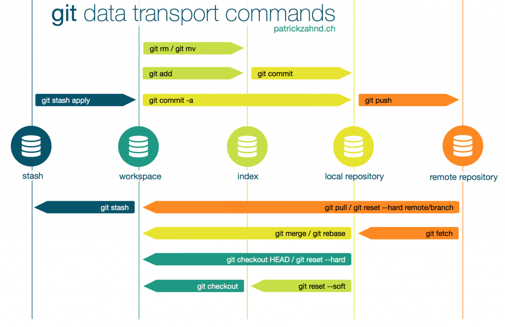
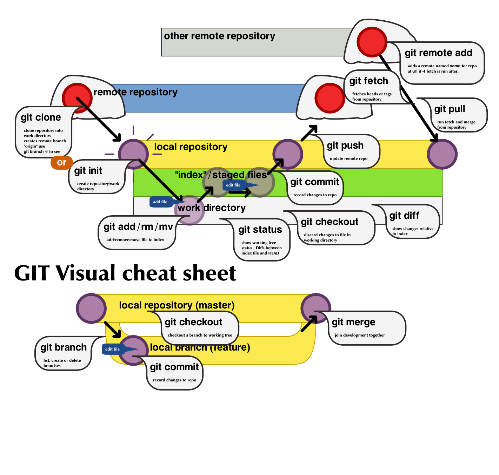

Git Commands
============

### Info
+ `HEAD` is the most recent commit on the branch I'm in currently. More about `HEAD`s in [REFERENCE](https://stackoverflow.com/questions/17595524/orig-head-fetch-head-merge-head-etc/).
+ There are three local stages: The **working directory** (or working tree) where the modified files go. When you stage them, they go to the **staging index**. When you commit staged changes they get promoted to the **commit history**.

### Getting & Creating Projects

| Command | Description |
| ------- | ----------- |
| `git init` | Initialize a local Git repository |
| `git clone ssh://git@github.com/[username]/[repository-name].git` | Create a local copy of a remote repository |

### Config

| Command | Description |
| ------- | ----------- |
|`git config [--global] credential.helper store`| Stores the credentials in plaintext on your PC's disk. Potentially dangerous. Used with the `https` protocol.|

### Basic Snapshotting

| Command | Description |
| ------- | ----------- |
| `git status` | Check status |
| `git add [file-name.txt]` | Add a file to the staging area |
| `git add -A` | Add all new and changed files to the staging area |
| `git commit -m "[commit message]"` | Commit changes |
| `git rm -r [file-name.txt]` | Remove a file (or folder) |

### Branching & Merging (Local Operations)

| Command | Description |
| ------- | ----------- |
| `git branch` | List branches (the asterisk denotes the current branch) |
| `git branch -a` | List all branches (local and remote) |
| `git branch [branch name]` | Create a new branch |
| `git branch -d [branch name]` | Delete a branch |
| `git checkout -b [branch name]` | Create a new branch and switch to it |
| `git branch -m [old branch name] [new branch name]` | Rename a local branch |
| `git checkout [branch name]` | Switch to a branch |
| `git checkout -` | Switch to the branch last checked out |
| `git checkout -- [file-name.txt]` | Discard changes to a file |
| `git merge [branch name]` | Merge a branch into the active branch |
| `git merge [source branch] [target branch]` | Merge a branch into a target branch |
| `git cherry-pick [--no-commit] <commit>` | Used for picking a single commit from another branch. `--no-commit` will execute the cherry pick but instead of making a new commit it will move the contents of the target commit into the working directory of the current branch.[REFERENCE](https://www.atlassian.com/git/tutorials/cherry-pick) |

### Resolving Conflincts

| Command | Description |
| ------- | ----------- |
| `git mergetool` | Launch mergetool to solve conflicts. |
| `git diff --name-only --diff-filter=U` | List conflicting files. |
| `git diff --check` | List conflicting files. |
| `git merge --abort` | Abort merge while you are still solving conflicts and didn't finish merging. |
| `git add <file>; git commit -m "<msg>"` | How to manually solve a conflict: You add files you have manually edited to solve the conflict, then you commit the changes. |
| `git merge master [--theirs] [--ours]` | When checked out at the `feature-branch`: To keep changes from master use `--theirs`, To keep changes from `feature-branch` use `--ours`|
| `git rebase master [--theirs] [--ours]` | When checked out at the `feature-branch`: To keep changes from master use `--ours`, To keep changes from `feature-branch` use `--theirs`|
| `git checkout [--theirs] -- <path/to/conflicted-file.txt>` | This solves conflicts for an entire file at once. To keep changes from master use `--ours`, To keep changes from `feature-branch` use `--theirs`. [REFERENCE](https://stackoverflow.com/questions/278081/resolving-a-git-conflict-with-binary-files/2163926)|

### Stash

| Command | Description |
| ------- | ----------- |
| `git stash` | Stash changes in a dirty working directory. Same as `git stash push`. |
| `git stash apply <stash_id>` | Retrieves modifications from the stash without removing it from the stash |
| `git stash pop <stash_id>` | Retrieves modifications from the stash and removes it from the stash |
| `git stash list` | Lists all stashed entries |
| `git stash show [-p]` | Show the changes recorded in the stash entry as a diff between the stashed contents and the commit back when the stash entry was first created. `-p` shows the diff content. Optionally you can pass the stash id, e.g. stash@{2}, if the you are interested in an entry other than stash@{0}. |
| `git stash drop <stash_id>` | Drops a single entry from the stash |
| `git stash clear` | Remove all stashed entries |

### Sharing & Updating Project (Remote Operations)

| Command | Description |
| ------- | ----------- |
| `git push <remote_name> <branch_name> [--dry-run] [--prune] [--force]` | Push a branch to your remote repository. If remote and branch name are ommitted, it is going to push to origin with the same branch name. `--dry-run` simulates everything, but does not push the updates. `--prune` removes all branches which are not locally present, use it carefully! Usually, the command refuses to update a remote ref that is not an ancestor of the local ref used to overwrite it, `--force` disables this check.|
| `git push [remote_name]` | Push changes to remote repository (remembered branch). To origin. Same branch name. If you would use the remote name, it would push to the same branch name but in other remote, instead of using origin as the remote. |
| `git push <remote_name> --delete <branch_name>` | Delete a remote branch |
| `git fetch <remote_name> [--prune] [--all] [--dry-run]` | Fetches all ref data from remote repository, but does not change anything on the working copy, needing a merge after. `--prune` will connect to a shared remote repository remote and fetch all remote branch refs. It will then delete remote refs that are no longer in use on the remote repository. `--all` fetches data from all the remotes. |
| `git pull` | Update local repository to the newest commit |
| `git pull <remote_name> <branch_name>` | Pull changes from remote repository. It does a fetch (therefore most of the options are shared with fetch), and then a `git merge FETCH_HEAD`. |
| `git remote add origin ssh://git@github.com/[username]/[repository-name].git` | Add a remote repository |
| `git remote set-url origin ssh://git@github.com/[username]/[repository-name].git` | Set a repository's origin branch to SSH |

+ `git fetch` is the command that tells your local git to retrieve the latest meta-data info from the original (yet doesn't do any file transferring. It's more like just checking to see if there are any changes available). `git pull` on the other hand does that AND brings (copy) those changes from the remote repository.
+ [What are GIT Refs?](https://git-scm.com/book/en/v2/Git-Internals-Git-References): A simple name so you could use that simple name rather than the raw SHA-1 value to refer to the commits.
#### Branch Tracking

| Command | Description |
| ------- | ----------- |
| `git checkout --track <remote_name>/<branch_name>` | Create a local branch that tracks a remote branch. `git fetch` FIRST to make sure your repo is updated with remote references and `git checkout --track <remote_name>/<branch_name>` should be enough. If `--track` is not present, git will checkout to <remot_name>/<branch_name> and enter detached HEAD mode locally, so you'd have to create a local branch to commit it manually. Then you can commit to that branch and a `git push` to sync the remote with your changes. Note that `--track <remote_name>/<branch_name>` is shorthand for `git checkout -b <branch_name> <remote_name>/<branch_name>`. [REFERENCE](https://stackoverflow.com/questions/520650/make-an-existing-git-branch-track-a-remote-branch). |
| `git push -u <remote_name>/<branch_name>` | Push changes to remote repository and track the newly created branch. |
| `git branch -u <remote_name>/<branch_name>` | Set a tracking relationship for your current HEAD branch at any time. |
|`git branch -vv`| List branches tracking data. [REFERENCE](https://stackoverflow.com/questions/4950725/how-can-i-see-which-git-branches-are-tracking-which-remote-upstream-branch). |
+ For tracking, there are three operations: **Pull from remote** and make a tracking relationship (`--track`), **Push to remote** creating a <remote>/<my_branch> remote branch (`push --set-upstream`), and simply **Setting a tracking relationship** between two branches (a local and a remote) (`branch --set-upstream`). [REFERENCE](https://www.git-tower.com/learn/git/faq/track-remote-upstream-branch/).

> There's no difference between `<remote_name> <branch_name>` and `<remote_name>/<branch_name>`.

### Inspection & Comparison

| Command | Description |
| ------- | ----------- |
| `git log` | View changes |
| `git log --summary` | View changes (detailed) |
| `git log --oneline [--graph]` | View changes (briefly) |
| `git log <master>..<otherBranch>` | This will show you commits that <otherBranch> has but <master> doesnt. |
| `git log --oneline --decorate --left-right --graph master...origin/master` | This will show you both the commits that A has and that B doesn't have, and the commits that B has that A doesn't have. In other words, it will filter out all of the commits that both A and B share, thus only showing the commits that they don't both share. [REFERENCE](https://stackoverflow.com/questions/462974/what-are-the-differences-between-double-dot-and-triple-dot-in-git-com) |
| `git diff [--staged] [--name-only]` | Preview changes between the working directory (or the staged area with `--staged`) and last commit. For commits other than the last one, just add the commit as an argument at the end. `--name-only` supresses the content of each file in the diff output. |
| `git diff [--staged] [--name-only] <source_commit> <target_commit>` | Preview changes between <source_commit> (or the staged area with `--staged`) and <target_commit>. Behaves the same as "<source_commit>..<target_commit>, i.e. compares their HEADs." |
| `git diff [--staged] [--name-only] <source_commit>...<target_commit>` | Shows changes in branch <target_commit> since it was branched from branch <source_commit> |
| `git diff <source_branch> <target_branch>` | Preview changes before merging |
| `git show <source_branch> <target_branch> [--name-only]` | Preview changes before merging |

+ To see non-staged (non-added) changes to existing files: `git diff`. To see staged, non-commited changes: `git diff --cached`
+ git diff simply looks at the bare difference between two commits. git log looks at the difference of the whole history between these two commits.
+ [Difference between diff, log A..B, and show](https://stackoverflow.com/questions/25608809/git-log-p-vs-git-show-vs-git-diff)
+ Space, double-dot and triple-dot Syntax: Space and double-dot are the same. Compares to commits, just that.  Triple-dot syntax shows the differences between A and B starting at the last common commit. [REFERENCE1](https://matthew-brett.github.io/pydagogue/git_log_dots.html) [REFERENCE2](https://matthew-brett.github.io/pydagogue/git_diff_dots.html)
+ When you use branches on diff, it will compare the HEAD commits between those two.

### Managing Tags

| Command | Description |
| ------- | ----------- |
| `git tag [--list] [-n]` | List all local tags. If run with the option `--list` it also works with globbing pattern match. `-n` also prints the annotations.|
| `git ls-remote --tags <remote>` | List all remote tags from a remote.|
| `git pull --tags` | Pull all tags from remote.|
| `git push --tags` | Push all tags to remote.|
| `git checkout tags/<tag_name>` | Checkout to detached HEAD using the tag.|
| `git checkout tags/<tag_name> -b <branch_name>` | Create new branch using the tag version.|
| `git tag [-a] [-m]` | Create new tag. Lightweight ones are created simply by typing "git tag <tag_name>", and they don't show on the commit itself, as you can prove by using `git show <tag_name>`. With the option `-a` you can annotate the commit with the tag, and it goes with the option `-m` you giving it a message as well. Lastly, you can also tag older commits using `git tag -a <tag_name> <commit_hash>.|
| `git tag -d <tag name>` | Delete tag locally.|
| `git push --delete <remote_name> <tag_name>` | Delete tag from remote.|
| `git fetch --prune-tags <remote_name>` | Remove all local tags which are not also present in remote.|

### Managing commit history (undoing and stuff)

| Command | Description |
| ------- | ----------- |
| `git reset [--soft\|mixed\|hard] <commit>` | Changes HEAD to the given commit, effectively discarding the commits between the old HEAD and the given commit. `hard`: changes will be removed from the working directory and from the index, you will lose all modifications. `mixed`: keeps changes in the working directory but NOT in the index (i.e. files with discarded changes will show up as *untracked* ). `soft`: Git is instructed not to modify the files in the working directory or in the index at all (i.e. files with affected changes will show up as staged.) [REFERENCE1](https://www.atlassian.com/git/tutorials/undoing-changes/git-reset) [REFERENCE2](https://devconnected.com/how-to-undo-last-git-commit/) |
| `git checkout HEAD -- my-file1.txt my-file2.txt` | Reset/Discard changes for a given file. It could be used to reset the files to any commit instead of the HEAD. ) [REFERENCE1](https://stackoverflow.com/questions/7147270/hard-reset-of-a-single-file) |
| `git revert <commit>` | The `git revert` command is slightly different from the `git reset` command because it will record a new commit with the changes introducted by reverting the last commit. Note also that with `git reset` you would specify 'HEAD~1' to undo the last commit because the reset command sets a new HEAD position while reverting actually reverts the commit specified. As a consequence, you will have to commit the changes again for the files to be reverted and for the commit to be undone. |
| `git revert [--no-commit] <commit>..<other_commit>` | Reverts a range of commits. The `--no-commit` flag lets git revert all the commits at once - otherwise you'll be prompted for a message for each commit in the range, littering your history with unnecessary new commits. |
| `git rebase [-i] <commit>` | Git rebase in standard mode will automatically take the commits in your current working branch and apply them to the head of the passed branch. Running git rebase with the -i flag begins an interactive rebasing session. Instead of blindly moving all of the commits to the new base, interactive rebasing gives you the opportunity to alter individual commits in the process. This lets you clean up history by removing, splitting, and altering an existing series of commits. `git rebase --abort` to cancel the rebase operation. [REFERENCE](https://www.atlassian.com/git/tutorials/rewriting-history/git-rebase) |
| `git commit --amend [-m "New commit message">]` | Only use this one if you HAVENT pushed changes to remote. Amends/Rectify the previous commit. First, make the changes you want and stage those changes. [REFERENCE](https://stackoverflow.com/questions/179123/how-to-modify-existing-unpushed-commit-messages) |

+ HEAD is the most recent commit in the current branch
+ HEAD~1 (or HEAD^): one commit before HEAD in the index
+ HEAD~2 (or HEAD^^): two commits before HEAD in the index
+ master~1 (or master^): notation can also be used aiming at branches names.

> good sources: https://docs.gitlab.com/ee/topics/git/numerous_undo_possibilities_in_git/ and https://stackoverflow.com/questions/215718/how-can-i-reset-or-revert-a-file-to-a-specific-revision

### Managing Stages

| Command | Description |
| ------- | ----------- |
| `git clean [-f] [-i] [-n] [-d] <filename>` | Remove untracked files and dirs (with -d flag) |
| `git checkout -- <filename>` | Remove unstaged modified file |
| `git checkout .` | Remove all unstaged modified files |
| `git restore [--source=<commit>] [--staged] [--worktree] <filename>` |  Restores files in the working tree from either the index or another commit. This command does not update your branch. The command can also be used to restore files in the index from another commit. [REFERENCE](https://stackoverflow.com/questions/58003030/what-is-git-restore-command-what-is-the-different-between-git-restore-and-git)|
| `git reset [--soft\|mixed\|hard] <commit_hash>` | Reset the state of the branch to the referenced commit hash. For managing stage purposes the commit is gonna always be HEAD. `hard` removes the modifications permanentely, `mixed` unstage them to the working tree, and `soft` resets everything to the stage index (more useful when used to commits other than HEAD)  [REFERENCE](https://www.atlassian.com/git/tutorials/undoing-changes/git-reset) |

+ HARD: The Commit History ref pointers are updated to the specified commit. Then, the Staging Index and Working Directory are reset to match that of the specified commit. Any previously pending changes to the Staging Index and the Working Directory gets reset to match the state of the Commit Tree. This means any pending work that was hanging out in the Staging Index and Working Directory will be lost.
+ MIXED: This is the default operating mode. The ref pointers are updated. The Staging Index is reset to the state of the specified commit. Any changes that have been undone from the Staging Index are moved to the Working Directory.

### Stages

